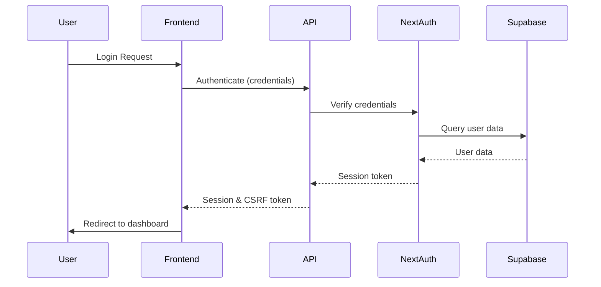
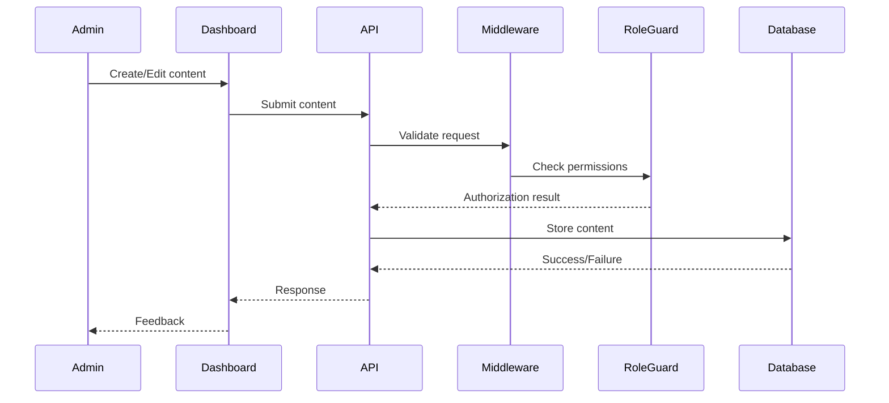
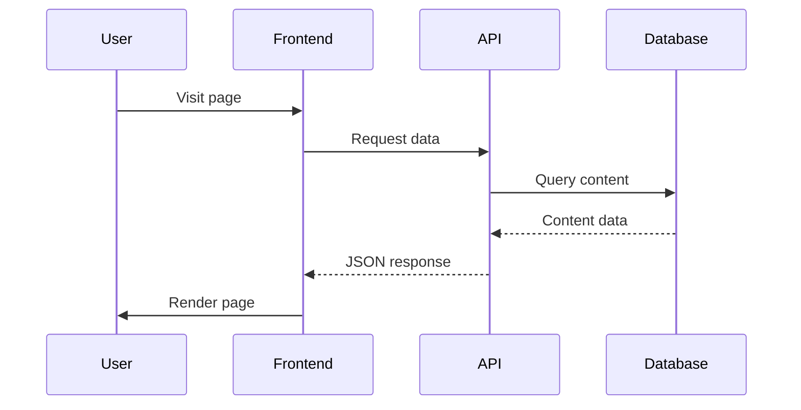

# Project Architecture

This document outlines the architecture of the OSINT Dashboard & Agency Website project, detailing key components, their interactions, and the technologies used.

## System Overview

The project is a headless admin dashboard and agency website built with modern web technologies. It consists of:

1. **Public-facing Agency Website** - Marketing site with service pages, blog, and lead generation forms
2. **Admin Dashboard** - Secure internal tool for content management and administration
3. **API Layer** - RESTful and GraphQL endpoints for data operations
4. **Authentication System** - Secure user management with role-based access
5. **Database Layer** - Supabase PostgreSQL for data persistence

## Tech Stack

| Category               | Technology                    | Purpose                                    |
| ---------------------- | ----------------------------- | ------------------------------------------ |
| **Frontend Framework** | Next.js 14+                   | Server-side rendering, routing, API routes |
| **UI Components**      | shadcn/ui, Radix UI           | Accessible, customizable components        |
| **State Management**   | React Context, TanStack Query | Global state and data fetching             |
| **Database**           | Supabase (PostgreSQL)         | Data storage, real-time subscriptions      |
| **Authentication**     | NextAuth.js, Supabase Auth    | User management, session handling          |
| **Styling**            | Tailwind CSS                  | Utility-first styling                      |
| **Localization**       | next-intl, i18n routing       | Multi-language support                     |
| **Forms**              | React Hook Form, Zod          | Form handling and validation               |
| **API**                | Next.js API Routes, REST      | Data operations                            |
| **Security**           | reCAPTCHA v3, HTTPS, CSRF     | Anti-bot, secure communications            |
| **Deployment**         | Coolify                       | Continuous deployment                      |

## Application Structure

```
/
├── app/                    # Next.js App Router
│   ├── [locale]/           # i18n routes
│   │   ├── admin/          # Admin dashboard routes
│   │   ├── auth/           # Authentication routes
│   │   ├── blog/           # Blog routes
│   │   └── (site)/         # Public site routes
│   ├── api/                # API routes
│   │   ├── auth/           # Auth-related endpoints
│   │   ├── blog/           # Blog content endpoints
│   │   └── webhooks/       # External service webhooks
├── components/             # Shared React components
│   ├── admin/              # Admin-specific components
│   ├── auth/               # Authentication components
│   ├── blog/               # Blog-specific components
│   ├── forms/              # Form components
│   ├── layout/             # Layout components
│   └── ui/                 # UI components (shadcn)
├── config/                 # Configuration files
├── db/                     # Database migrations and schemas
├── hooks/                  # Custom React hooks
├── lib/                    # Utility functions and shared logic
│   ├── auth/               # Authentication utilities
│   ├── api/                # API utilities
│   ├── supabase/           # Supabase client and helpers
│   └── validation/         # Zod schemas
├── locales/                # Translation files
├── public/                 # Static assets
└── styles/                 # Global styles
```

## Key Components and Interactions

### Authentication Flow



### Content Management Flow



### Public Site Data Flow



## Database Schema

The database uses a normalized schema with the following core tables:

- **users**: User accounts and authentication data
- **profiles**: Extended user profile information
- **roles**: User role definitions for RBAC
- **user_roles**: Junction table relating users to roles
- **blog_posts**: Blog content with metadata
- **blog_categories**: Categories for blog posts
- **blog_tags**: Tags for blog posts
- **forms_submissions**: Lead generation form submissions
- **password_reset_verifications**: Password reset tokens and verification
- **otp_verifications**: One-time password verification records
- **security_logs**: Audit logging for security events

## Security Architecture

Security is implemented across multiple layers:

1. **Network Layer**: HTTPS, secure headers
2. **Application Layer**: Input validation, CSRF protection
3. **Authentication Layer**: JWT, session management, MFA
4. **Authorization Layer**: RBAC, row-level security
5. **Database Layer**: Parameterized queries, encryption at rest

For detailed security information, see the [Security Model](./security-model.md) document.

## i18n Architecture

The application supports multiple languages through:

- Locale-based routing
- Runtime message translation with `next-intl`
- RTL layout support for Arabic
- Translation files stored in JSON format in `/locales`
- Server and client components translation support

## Deployment Architecture

The application is deployed using a CI/CD pipeline:

1. GitHub Actions for CI (tests, linting)
2. Automated deployment to Coolify
3. Environment-specific configurations
4. Database migrations applied automatically
5. Zero-downtime deployments

## Performance Considerations

The architecture prioritizes performance through:

- Server components for reduced client JavaScript
- Static generation where possible
- Edge functions for dynamic but fast APIs
- Optimized bundle sizes with code-splitting
- Image optimization with Next.js Image component
- Efficient database queries with proper indexing

## Extensibility

The system is designed for extensibility:

- Modular component architecture
- Pluggable authentication providers
- Extensible API using middleware pattern
- Clear separation of concerns
- Standardized state management patterns

## Monitoring and Observability

The application includes:

- Structured logging for all operations
- Error tracking integration
- Performance monitoring
- User activity analytics
- Security audit logging

## Future Architecture Considerations

Planned architectural enhancements:

- GraphQL API layer for more flexible data fetching
- Microservices for specific high-load components
- Enhanced real-time capabilities
- AI-powered content recommendations
- Edge computing for global performance
