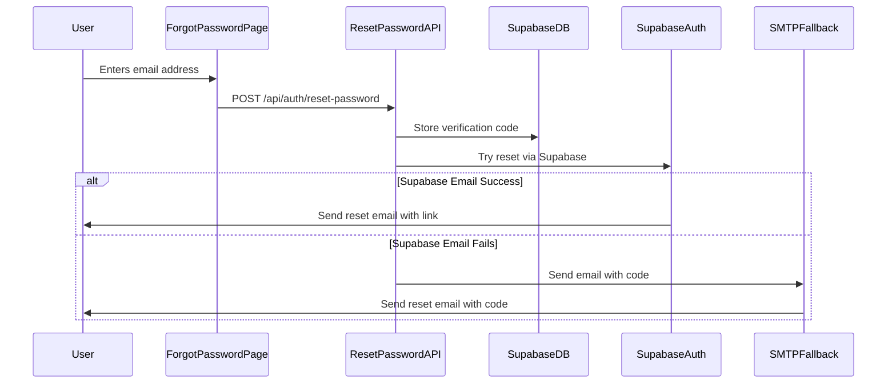
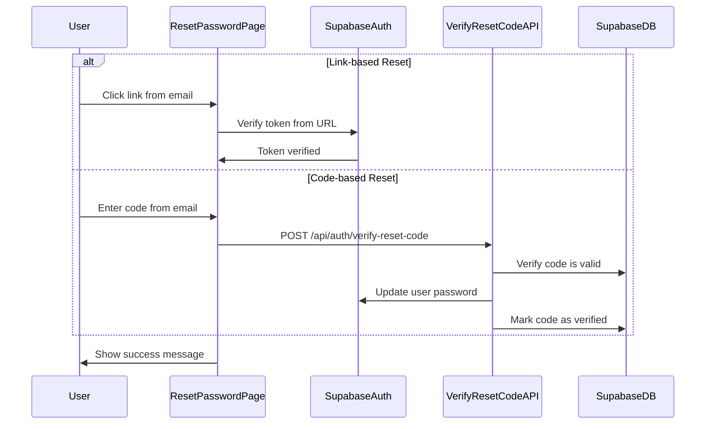

# Project Architecture: Password Reset Flow

This document outlines the architecture of the password reset system in the OSINT Dashboard, particularly focusing on how it integrates with Supabase locally.

## Architecture Overview

The password reset system uses a dual-delivery approach with both Supabase Auth and a custom SMTP fallback to ensure reliability. It's structured around these key components:

1. **Database Storage** - Password reset verification codes
2. **API Endpoints** - For requesting and verifying reset codes
3. **UI Components** - User-facing reset interfaces
4. **Email Delivery** - Dual-channel notification system

## Database Schema

### password_reset_verifications Table

```
┌─────────────┬─────────────┬──────────────────────────────┐
│ Column      │ Type        │ Description                  │
├─────────────┼─────────────┼──────────────────────────────┤
│ id          │ UUID        │ Primary key                  │
│ email       │ TEXT        │ User's email address         │
│ code        │ TEXT        │ Verification code            │
│ type        │ TEXT        │ Purpose (e.g. password_reset)│
│ verified    │ BOOLEAN     │ Whether code has been used   │
│ created_at  │ TIMESTAMPTZ │ Creation timestamp           │
│ expires_at  │ TIMESTAMPTZ │ Expiration timestamp         │
└─────────────┴─────────────┴──────────────────────────────┘
```

**Unique Constraint**: `(email, code, type, verified)` ensures no duplicate active codes.

## Component Diagram

```
┌─────────────────┐      ┌─────────────────┐      ┌─────────────────┐
│                 │      │                 │      │                 │
│  Forgot         │      │  Password       │      │  Reset          │
│  Password Page  │─────▶│  Reset API      │─────▶│  Password Page  │
│                 │      │                 │      │                 │
└─────────────────┘      └─────────────────┘      └─────────────────┘
         │                        │                        │
         │                        ▼                        │
         │               ┌─────────────────┐              │
         │               │                 │              │
         └──────────────▶│  Supabase DB    │◀─────────────┘
                         │                 │
                         └─────────────────┘
                                 │
                                 ▼
                         ┌─────────────────┐
                         │                 │
                         │  Email Delivery │
                         │  (Dual-channel) │
                         │                 │
                         └─────────────────┘
```

## Password Reset Flow

### 1. Request Phase

When a user requests a password reset:



**Code Flow:**
1. User submits email on `/auth/forgot-password`
2. Request sent to `app/api/auth/reset-password/route.ts`
3. API generates a random 6-digit code
4. Code stored in `password_reset_verifications` table
5. Primary attempt: Supabase Auth's `resetPasswordForEmail`
6. Fallback: Custom SMTP email with verification code

### 2. Verification Phase

When a user resets their password:



**Code Flow:**
1. User arrives at `/auth/reset-password` with either:
   - PKCE token from Supabase Auth link
   - Verification code from email
2. For code-based reset:
   - Request sent to `app/api/auth/verify-reset-code/route.ts`
   - API verifies code against `password_reset_verifications` table
   - API uses Supabase Admin API to update password
   - Verification record marked as used

## Working with Local Supabase

### Mail Testing Environment

For local development, the Supabase Inbucket service captures all emails sent through either method:

1. Access Inbucket at http://127.0.0.1:54324
2. All emails sent by Supabase Auth or SMTP will appear here

### Database Setup

To set up the database locally:

1. Navigate to `/admin/setup` with super admin access
2. Use the "Set up OTP Table" button to create the necessary table
3. Alternatively, use SQL migrations:
   ```bash
   npx supabase db reset
   ```

### Custom API for Direct Table Creation

The application includes an API endpoint to create the necessary tables directly:

```typescript
// app/api/db/create-otp-table/route.ts
export async function POST() {
  try {
    const supabase = createServerSupabaseClient();
    const { error } = await supabase.rpc('exec_sql', { sql: createTableSQL });
    // ...
  } catch (error) {
    // ...
  }
}
```

This endpoint can be accessed via:
```bash
curl -X POST http://localhost:3000/api/db/create-otp-table
```

## Error Handling & Edge Cases

The system handles several edge cases:

1. **Non-existent user email**
   - System still sends "reset instructions sent" message for security
   - No actual code is stored or email sent

2. **Expired verification codes**
   - Codes expire after 1 hour (`expires_at` field)
   - User must request a new code

3. **Multiple reset requests**
   - Each request generates a new valid code
   - Old codes remain valid until expiration

4. **Email delivery failures**
   - Dual delivery system increases reliability
   - Supabase Auth handles primary delivery
   - Custom SMTP provides fallback

## Security Considerations

1. **Rate limiting**
   - API endpoints should be rate-limited in production

2. **Safe error messages**
   - Never reveal if an email exists in the system

3. **Row-Level Security**
   - Service role required for most operations
   - Users can only see their own verification codes

4. **Code expiration**
   - All codes expire after 1 hour

5. **One-time use**
   - Codes are marked as verified after use

## Testing the Flow

1. Start Supabase locally:
   ```bash
   npx supabase start
   ```

2. Start the application:
   ```bash
   npm run dev
   ```

3. Navigate to the test page:
   ```
   http://localhost:3000/auth/forgot-password/test
   ```

4. Enter a valid email address

5. Check Inbucket for the email:
   ```
   http://localhost:3001:54324
   ```

6. Complete the password reset process 